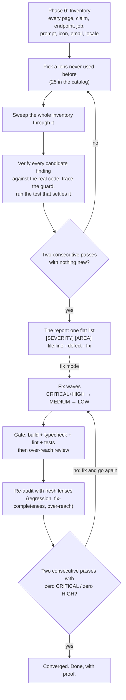

<div align="center">


# 🔍 application-auditor

[](LICENSE)
[](https://docs.claude.com/en/docs/claude-code)
[](application-auditor/references/audit-angles.md)
[](application-auditor/references/finding-taxonomy.md)
[](PROMPT.md)

```
/application-auditor
```

</div>

Most "audit my code" prompts do one pass, find 15 issues, and write you a reassuring summary. This skill is built to keep going: it sweeps your product through **25 diverse audit lenses** pass after pass, runs mechanical scanners and exercises your **running localhost** instance to prove what it finds, and stops only when it converges — two consecutive passes that surface nothing new across full coverage.

## How it works



The skill inventories every surface your product has (pages, routes, claims, jobs, prompts, icons, emails, locales), then sweeps that inventory through **25 different audit lenses**, one lens per pass. It runs the ecosystem's mechanical analyzers first (secret scanners over git history, CVE audits, `semgrep`, typecheck), and when your app is running on **localhost** it *exercises the live product* — hitting every endpoint, running the auth matrix across real sessions, probing for races and missing rate limits — so findings are proven against the running server, not just inferred from code. Discovery stops only when **two consecutive passes find nothing new and every inventory item has been swept by every lens**. In fix mode, a second loop runs after the fixes until **two consecutive passes find zero CRITICAL/HIGH**. "We checked" becomes "we converged."

**Read-only by default:** a plain `/application-auditor` run never edits your source. It writes only the report and its own `.audit/` working files. Your code changes only in `fix` mode, only after you ask. Live testing is localhost-only with hard safety rails — it can write disposable test data to your *local dev database* but never touches production and never leaves the machine.

## Why convergence beats a checklist

|  | A one-shot "audit my code" prompt | `application-auditor` |
|---|---|---|
| **Passes** | one | as many as it takes; stops after 2 consecutive quiet passes |
| **Framing** | whatever the prompt happens to emphasize | 25 deliberately diverse lenses, never repeated |
| **False positives** | reported confidently | every finding verified against the real code before it's reported |
| **Marketing claims** | ignored | every specific public promise verified or flagged |
| **Output** | summary + a few highlights | flat list, every row pinned to `file:line` |
| **"Done" means** | the context window filled up | convergence, proven twice over |

## How it compares to other audit tools

Multi-lens auditing and convergence-style stopping aren't unique to this skill. [RepoLens](https://github.com/TheMorpheus407/RepoLens), CheckLoop, and audit-loop all do versions of them, and Anthropic ships a built-in `/security-review`. What this skill adds is two things none of them do by default: it verifies your **public claims against the code**, and it **verifies every finding by default** (not as an opt-in flag) before reporting it.

| | application-auditor | RepoLens / audit-loop | `/security-review` |
|---|---|---|---|
| Multiple audit lenses | ✅ 25 | ✅ (RepoLens: many) | one (security) |
| Convergence / self-terminating loop | ✅ (capped heuristic) | ✅ | single pass |
| Claim-vs-code (marketing/docs vs implementation) | ✅ | ✗ | ✗ |
| Per-finding verification | ✅ default-on | RepoLens: opt-in, off by default | ✅ |
| Whole-repo (not just the diff) | ✅ | ✅ | diff-focused |
| Output | flat `file:line` list, no summary | varies | inline PR comments |

We didn't invent multi-lens or convergence. The edge is claim-vs-code plus verification-by-default.

## What a finding looks like

No executive summary. No "overall, the codebase is in good shape." Every row is pinned and actionable:

```
[CRITICAL] [SECURITY] src/lib/cache.ts:21 - dashboard cache key omits the workspace id; one tenant's data served to another - add the tenant to the key
[CRITICAL] [AUTH] src/api/admin/users.ts:9 - admin role checked only in the UI; the endpoint returns every user to any session - enforce the role server-side
[HIGH] [DATA] src/import/processor.ts:142 - document row committed before its permission row, non-atomically; content is live and unprotected in the gap - one transaction, permission first
[HIGH] [CONTENT] landing/security.html §hero - claims "AES-256 encryption at rest"; no encryption configured anywhere in the storage layer - implement it or remove the claim
[HIGH] [AI] src/prompts/extract.ts:18 - prompt asks for prose but the parser JSON.parses the reply; every extraction silently yields [] - demand JSON, validate, surface failures
[HIGH] [RELIABILITY] src/realtime/hub.ts:33 - per-connection handlers never unsubscribed on disconnect; memory grows with every connect cycle - clean up in the close handler
[MEDIUM] [PERF] src/dashboard/page.tsx:61 - members fetched per project in a loop (N+1, ~40 queries per load) - one grouped query
[LOW] [CONTENT] pricing.html §faq - "recieve" twice; failed-payment state renders raw "Error: ECONNREFUSED" - fix the copy, map errors to human text
```

Rules the skill enforces on itself: every row has `file:line` or `URL + selector` (no location means dropped), no "consider/might/could", no padding, and an honest `TRUNCATED AT ...` line if it runs out of context instead of a fake wrap-up.

Want more? See the **[sample report](examples/sample-report.md)**: 30 anonymized rows showing what a converged run's output looks like, plus both convergence ledgers.

## The 25 lenses

Each discovery pass takes exactly one lens and sweeps the entire inventory through it; the diversity is what makes "we found everything" credible. A mechanical-tools pass (secret scan over git history, CVE audit, `semgrep`, typecheck) runs before them all. Full catalog with a real example finding per lens in [audit-angles.md](application-auditor/references/audit-angles.md).

| # | Lens | What it makes visible |
|---|------|----------------------|
| 1 | Subsystem sweep | one subsystem traced end to end; builds the map the other lenses need |
| 2 | Attack-class | IDOR, cross-tenant leaks, injection, exposed secrets, unverified webhooks |
| 3 | Claim-vs-code | every public promise traced to the code that delivers it |
| 4 | Data-shape | zero / one / huge / unicode / 100k-row data through every flow |
| 5 | Platform divergence & responsiveness | web vs mobile vs CLI vs API parity; every page at every width |
| 6 | Lifecycle | signup → daily use → offboarding → deletion; do retention promises hold? |
| 7 | Write-path integrity | idempotency; non-atomic sibling writes (record live before its permission row) |
| 8 | Failure-mode | every dependency down, slow, or returning garbage |
| 9 | Dead-and-stale | docs for removed features, shipping TODOs, flags off with live marketing |
| 10 | Gate-run & gate-escape | actually run build/typecheck/lint/tests, then hunt what slips past them |
| 11 | Perf | N+1, missing indexes, Core Web Vitals, unoptimized images, uncapped calls |
| 12 | A11y & UX-jank | focus, ARIA, contrast, broken animations, spinners with no failure path |
| 13 | Content & copy | typos, placeholder text, jargon, stack traces rendered to users |
| 14 | Asset & icon integrity | broken images, mixed icon sets, missing favicons, fonts that never load |
| 15 | Connection & wiring | dead endpoints, hardcoded staging URLs, DB pool leaks, test keys in prod |
| 16 | LLM & prompt quality | prompts contradicting their parsers, unvalidated output, uncapped spend |
| 17 | Auth & permissions deep-dive | the full role x action matrix, sessions, tokens, resets, MFA, stale grants |
| 18 | Resource leaks & long-running drift | what grows with uptime: listeners, caches, handles, temp files |
| 19 | Observability & operations | could the team even tell it's broken? swallowed errors, no alerts, no logs |
| 20 | Abuse & limits | what a hostile user can do unboundedly: rate limits, quotas, spam vectors |
| 21 | Config & environment | env vars unvalidated at boot, dev defaults in prod, drifted configs |
| 22 | Dependency & supply-chain | CVEs in the lockfile, abandoned packages, license conflicts |
| 23 | Caching correctness | keys missing tenant scope, stale after writes, auth cached past revocation |
| 24 | Concurrency & races | double-submit, two tabs, two workers on one job, check-then-act gaps |
| 25 | Live testing (localhost) | drives the running app: every endpoint, real-session auth matrix, races, rate-limit probes, hostile uploads, header/error-leak checks |

Plus three verification-only lenses for after the fixes: **regression**, **fix-completeness** (the same mistake is almost never made once), and **over-reach**.

## The kinds of bugs it catches that tests don't

From real runs:

- **Non-atomic sibling writes**: a record persisted *before* its permission row, leaving a window where private content was retrievable workspace-wide. Invisible to tests; found by the write-path-integrity lens.
- **Gate-escapes**: type errors in generated code that passed both the typechecker (runs before generation) and the build (configured to ignore errors). Found by auditing the gates themselves.
- **Flagged-but-broken state**: records marked searchable whose index entry was deleted and never rebuilt: present in every count, absent from every search.
- **Promises with no code**: security-page claims with zero implementing lines.

## Install

**Claude Code (easiest)**: install as a plugin.

```
/plugin marketplace add arjuncirakas/application-auditor-claude-skill
/plugin install application-auditor@arjuncirakas
```

**Claude Code (manual)**: copy the skill folder.

```bash
git clone https://github.com/arjuncirakas/application-auditor-claude-skill.git
# personal (all projects)
cp -r application-auditor-claude-skill/application-auditor ~/.claude/skills/
# or per-project (shared with your team via the repo)
cp -r application-auditor-claude-skill/application-auditor your-project/.claude/skills/
```

**Everything else** (Cursor, Windsurf, Copilot, aider, raw API): paste [PROMPT.md](PROMPT.md). Same methodology, single file, zero install.

## Use

| Command | What you get |
|---------|--------------|
| `/application-auditor` | full product audit, discovery only; nothing is modified |
| `/application-auditor fix` | audit → fix in severity waves → verification loop until 2 clean passes |
| `/application-auditor security` | one lens family at full depth |
| `/application-auditor src/billing` | one subsystem through all 25 lenses |
| `/application-auditor docs-vs-code` | every public claim verified against the implementation |

Works on any stack: web app, API, CLI, mobile, monorepo. The skill builds its inventory from *your* product's surfaces before it audits, so nothing is assumed about your architecture.

**Live testing against localhost (optional but powerful):** if your app is running locally, the audit will drive it to *prove* findings against the running server. It auto-detects common dev ports; for auth-gated testing across roles, drop a `.audit/target.json` at your repo root:

```json
{
  "baseUrl": "http://localhost:3000",
  "environment": "dev",
  "auth": {
    "type": "cookie",
    "loginUrl": "http://localhost:3000/api/auth/login",
    "users": [
      { "role": "admin",  "email": "admin@zzaudit.local",  "password": "..." },
      { "role": "member", "email": "member@zzaudit.local", "password": "..." }
    ]
  },
  "skipPaths": ["/api/admin/wipe", "/api/billing/charge"],
  "safeToWrite": true
}
```

Two accounts across roles is what unlocks real IDOR and cross-role testing. Safety is hard-wired: **localhost/private hosts only, never production, no override**; writes go only to your local dev DB, are prefixed `zzaudit-` for easy cleanup, and are logged to `.audit/live-writes.log`.

> **Heads up:** the full pipeline is thorough by design. Discovery on a real product produces hundreds of rows, and `fix` mode will happily run 10+ verification rounds. Scope it if you want a quick pass.

**Suppressing known false positives:** drop a `.audit-ignore` file at your repo root and future runs will skip findings you've already triaged. One entry per line, `path:line  issue-tag  # reason`, and the reason is required. The audit only reads this file; it never writes to it, so it can't quietly hide a real bug from you.

## Reading the report

| Tag | Means | Example |
|-----|-------|---------|
| `CRITICAL` | data loss, breach reachable today, broken core flow, crash on a primary path | cross-tenant cache leak |
| `HIGH` | claimed feature broken/missing, security weakness one precondition away, silent failure | payment-webhook failures swallowed |
| `MEDIUM` | degraded behavior, edge-case failure, real inconsistency | chart crashes on an empty dataset |
| `LOW` | minor bug, cosmetic defect, polish | missing favicon |
| `IMPROVEMENT` | a concrete, named upgrade, still no hedging | atomic decrement instead of check-then-act |

Rows are ordered CRITICAL → IMPROVEMENT and grouped by area (`SECURITY`, `AUTH`, `DATA`, `PERF`, `CONTENT`, ...) within each severity, so a team can fix top-down, row by row.

## Limitations

Worth knowing before you rely on it:

- **Source-first; runtime is localhost-only.** It reads your code, config, and docs, and runs mechanical tools over them. It can also exercise a *locally running* instance to prove findings, but it does not analyze binaries or containers, never touches production or any remote host, and supply-chain coverage stops at what the lockfile reveals.
- **Not deterministic.** Two runs can surface different findings and stop at different points. It's an audit aid, not a reproducible compliance gate.
- **Cost and time scale with the repo.** A full converged run on a large product takes hours and real token spend. Scope it when you don't need the whole thing.
- **Convergence bounds, it doesn't prove.** Two quiet passes mean these 25 angles stopped finding things, not that nothing remains. It's a strong "we looked hard enough" heuristic with a cap, not a guarantee.

## What's in the box

```
application-auditor/
├── SKILL.md                        # the skill: process, format, rules
└── references/
    ├── audit-angles.md             # 25 discovery lenses, each with a real example finding
    ├── finding-taxonomy.md         # 18 defect classes + severity rubric + borderline calls
    └── live-testing.md             # localhost runtime tester: target config + safety rails
.claude-plugin/                     # plugin + marketplace manifests (for /plugin install)
examples/
└── sample-report.md                # 30 anonymized rows + both convergence ledgers
PROMPT.md                           # the whole methodology in one paste-able file
CHANGELOG.md                        # version history
```

## FAQ

<details>
<summary><b>How long does a full run take?</b></summary>

Hours, not minutes. That's the point. Discovery on a real product produces hundreds of rows across many passes, and `fix` mode routinely runs 10+ verification rounds. For a quick pass, scope it: `/application-auditor src/billing` or `/application-auditor security`.
</details>

<details>
<summary><b>Will it change my code?</b></summary>

Not unless you ask. The default run never edits your source: it reads everything and writes only the report plus its own `.audit/` working files. `fix` mode does edit, but only after you ask, on a fresh branch committed wave by wave, each wave gated on a green build + typecheck + lint + tests, with an over-reach review that reverts any change beyond its finding. One nuance: if live testing is on, the audit can write *disposable test data to your local dev database* (never your files, never production) to prove findings like races and IDOR, exactly as a manual tester clicking around would.
</details>

<details>
<summary><b>What about false positives?</b></summary>

Every candidate finding is verified against the real code before it's reported: is there a guard upstream? Is the check enforced elsewhere? Is that dead code actually unreachable? Does the test pass? Findings that can't be pinned to a `file:line` or `URL + selector` are dropped. The verification is evidence-gathering, not an attempt to argue the finding away (a located, uncleared security risk is reported, not dismissed), so the list stays both trustworthy and honest about what it can't fully rule out.
</details>

<details>
<summary><b>Why is there no executive summary?</b></summary>

Summaries are where audits go to soften. "Overall the codebase is in good shape" tells you nothing actionable and quietly buries the rows that matter. Every row in this report stands alone (severity, location, defect, fix), so the list itself is the deliverable.
</details>

<details>
<summary><b>My product isn't a web app. Does this still work?</b></summary>

Yes. Phase 0 builds the inventory from whatever surfaces *your* product actually has: CLI commands, API endpoints, mobile screens, background jobs, docs. Lenses that don't apply (e.g. LLM quality with no LLM features) are skipped; everything else runs at full depth.
</details>

<details>
<summary><b>What's the difference between SKILL.md and PROMPT.md?</b></summary>

Same methodology, two packagings. <code>application-auditor/SKILL.md</code> + its references install as a Claude Code skill, with the lens catalog and taxonomy loaded on demand. <code>PROMPT.md</code> is the whole thing flattened into one file you can paste into any other agent.
</details>

<details>
<summary><b>How do I know it actually converged instead of just stopping?</b></summary>

The skill keeps a pass ledger (pass number, lens used, new findings count) and is only allowed to stop when two consecutive passes from <i>different</i> lenses add zero new rows. Ten quiet sweeps of the same lens count as one angle, not ten. After fixes, the bar is two consecutive passes with zero CRITICAL/HIGH. To be precise about the claim: convergence is a strong "we looked hard enough" heuristic with a hard pass cap, not a mathematical proof that nothing remains (see <a href="#limitations">Limitations</a>).
</details>

## Philosophy

> Trust what the code does, not what it's called.
> A short list means you didn't look hard enough.
> One quiet pass is not convergence.

## Contributing

Found a defect class the taxonomy misses, or a lens that would have caught a bug in your product? PRs welcome: add the lens to [audit-angles.md](application-auditor/references/audit-angles.md) with a one-line example finding, and keep [PROMPT.md](PROMPT.md) in sync.

## License & credits

MIT. Use it, fork it, ship it. This project is a fork of the original [production-audit](https://github.com/apoorvjain25/production-audit) skill by Apoorv Jain (MIT), extended with a mechanical-tools pass, localhost runtime testing, broader attack-class coverage, and disk-persisted runs.

---

*If this skill finds something scary in your codebase, that's the skill working. ⭐ the repo and tell someone what it caught.*
